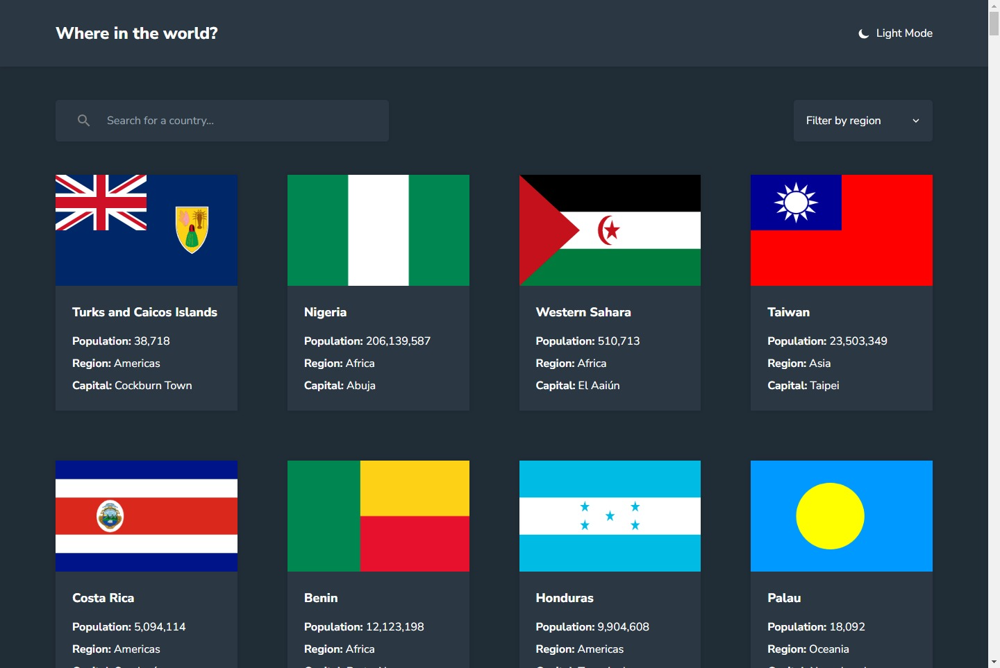
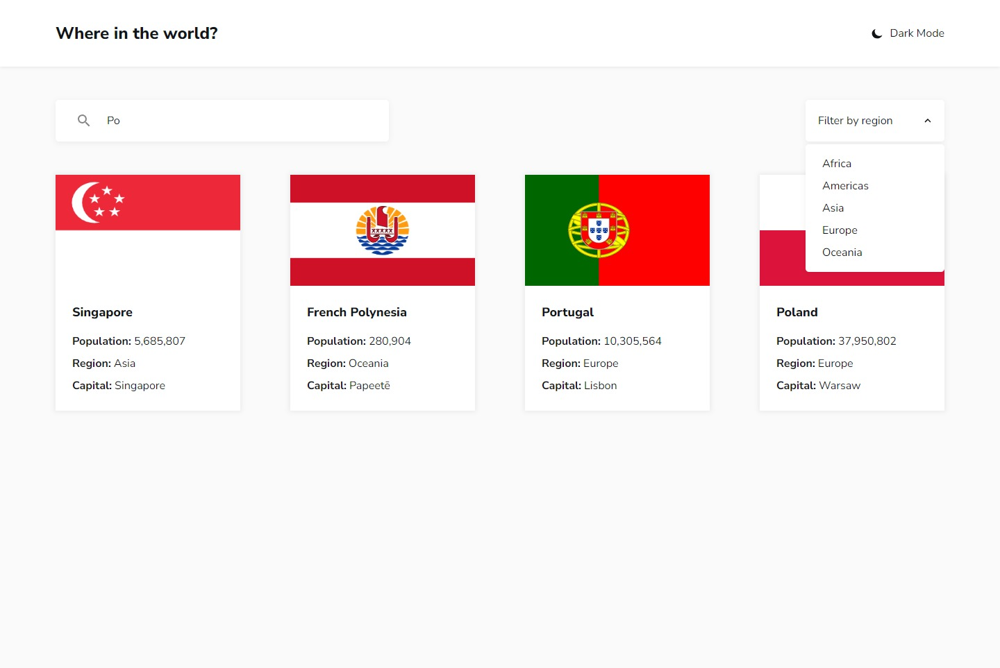
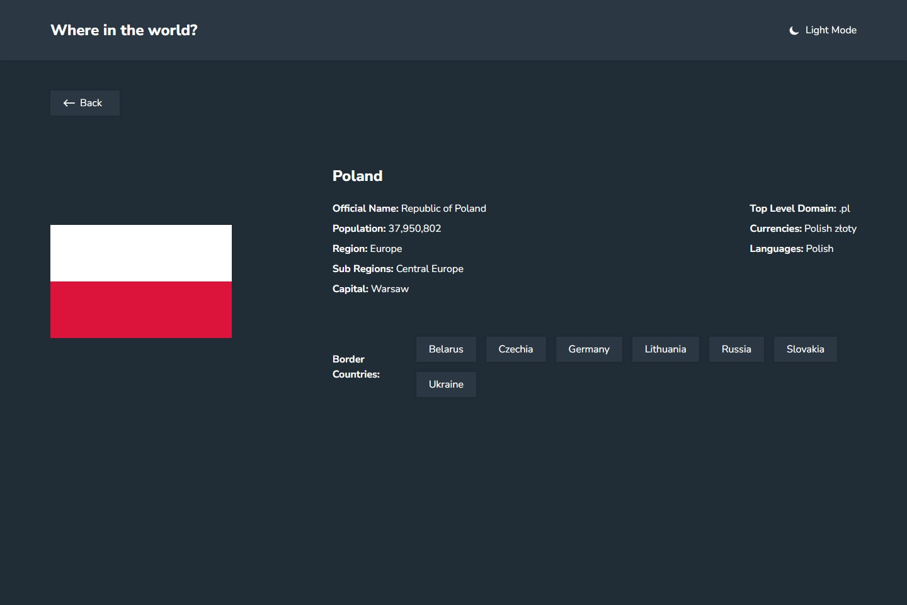

# Frontend Mentor - REST Countries API with color theme switcher solution

This is a solution to the [REST Countries API with color theme switcher challenge on Frontend Mentor](https://www.frontendmentor.io/challenges/rest-countries-api-with-color-theme-switcher-5cacc469fec04111f7b848ca). Frontend Mentor challenges help you improve your coding skills by building realistic projects.

## Table of contents

- [Overview](#overview)
  - [The challenge](#the-challenge)
  - [Screenshot](#screenshot)
  - [Links](#links)
  - [Built with](#built-with)
- [Author](#author)

## Overview

### The challenge

Users should be able to:

- See all countries from the API on the homepage
- Search for a country using an `input` field
- Filter countries by region
- Click on a country to see more detailed information on a separate page
- Click through to the border countries on the detail page
- Toggle the color scheme between light and dark mode

### Screenshot

### Links

- Solution URL: [Solution](https://www.frontendmentor.io/solutions/reactquery-typescript-tailwindcss-kinda-lazy-countries-s5XQggQ2Sr)
- Live Site URL: [LiveSite](https://bbualdo-countries.vercel.app)

### Built with

- React
- TypeScript
- TailwindCSS
- ReactQuery

## Author

- Website - [BBualdo](https://bbualdo-portfolio.netlify.app)
- Frontend Mentor - [@bbualdo](https://www.frontendmentor.io/profile/bbualdo)
